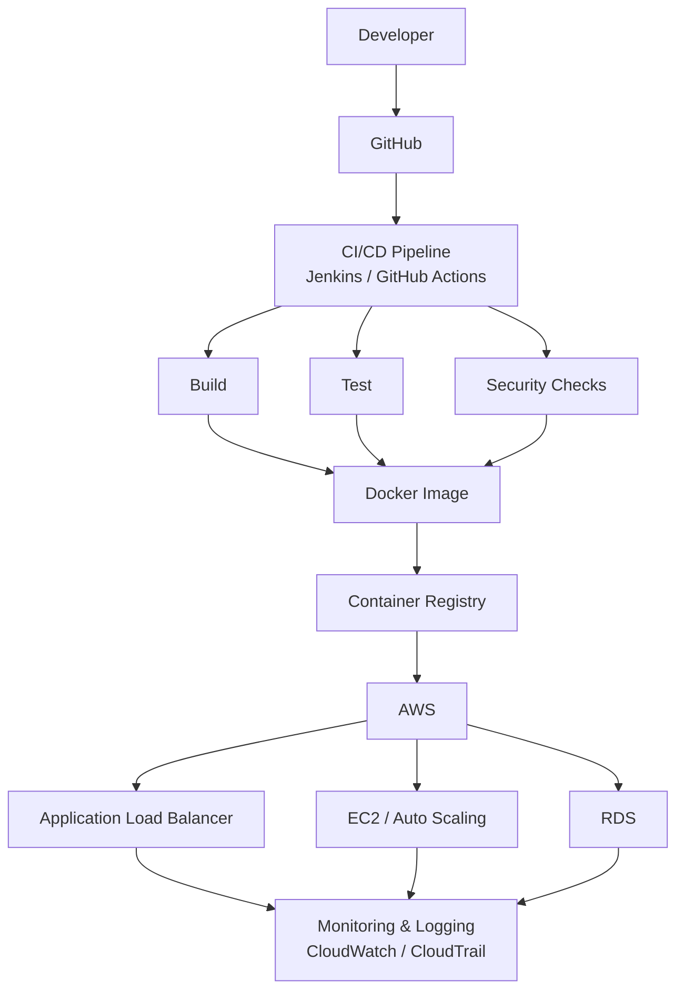
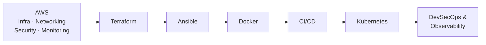

# Hi, I'm Kashif Khan 👋

### Cloud Infrastructure Engineer · DevOps Engineer · AWS

**Building secure, scalable, highly available, and automated cloud infrastructure.**

---

## About Me

I'm a **Cloud Infrastructure & DevOps Engineer** focused on designing, automating, deploying, and maintaining reliable infrastructure and application delivery platforms.

My current focus spans **AWS Cloud, Infrastructure as Code, CI/CD, containerization, Kubernetes, Linux administration, automation, monitoring, and DevSecOps**.

- ☁️ Designing and automating AWS cloud infrastructure
- 🏗️ Infrastructure as Code with Terraform
- 🔄 Building and maintaining CI/CD pipelines
- 🐳 Containerizing applications with Docker
- ☸️ Learning and applying Kubernetes orchestration
- ⚙️ Automating server configuration with Ansible
- 🖥️ Managing on-prem virtualization with VMware ESXi, vCenter, and Sangfor Cloud
- 🐧 Administering and hardening Linux systems
- 🔐 Practicing cloud security and DevSecOps
- 📊 Implementing monitoring, logging, and observability
- 🤝 Open to collaborating on **Cloud, DevOps, and Infrastructure** projects

---

## Tech Stack

---

## Cloud & Infrastructure — AWS

| Category | Services |
|---|---|
| **Compute** | EC2, Auto Scaling Groups, Launch Templates |
| **Networking** | VPC, Public/Private Subnets, Route Tables, Internet Gateway, NAT Gateway, Security Groups, Network ACLs, Application Load Balancer |
| **Storage & Database** | S3, EBS, RDS |
| **Security & Management** | IAM, KMS, CloudTrail, CloudWatch, Route 53 |

---

## DevOps & CI/CD

- Git & GitHub
- Jenkins, GitHub Actions
- CI/CD pipeline design and automation
- Automated build, test, and deployment
- Deployment strategies and rollback practices
- Production-grade deployment workflows

### Typical Delivery Flow

---

## Infrastructure as Code

**Terraform**
- AWS infrastructure provisioning
- Reusable, modular configurations
- Variables, outputs, and remote state
- Environment-based infrastructure (dev/stage/prod)
- Version-controlled infrastructure

**Ansible**
- Server provisioning and configuration management
- Application deployment automation
- Playbooks and roles

---

## Containers & Kubernetes

**Docker**
- Dockerfiles, images, and containers
- Docker Compose for multi-container apps
- Container networking and volumes

**Kubernetes** *(actively building hands-on experience)*
- Pods, Deployments, Services
- ConfigMaps, Secrets, Namespaces
- Ingress and networking
- Persistent Volumes
- Application scaling

---

## Security & DevSecOps

Security is treated as part of the infrastructure and deployment lifecycle, not an afterthought.

- IAM & least-privilege access design
- Security Groups & Network ACLs
- KMS and secrets management
- Secure SSH practices & Linux hardening
- Patch management
- CI/CD and container security
- Audit and logging with CloudTrail

---

## Monitoring & Observability

- AWS CloudWatch — Metrics, Logs, Alarms
- CloudTrail — audit and activity logging
- Application and system log analysis
- Infrastructure monitoring and incident troubleshooting

---

## Linux & System Administration

Ubuntu · CentOS · Linux Networking · Users & Permissions · SSH · systemd · Disk & Filesystem Management · EBS Volume Management · Package Management · Bash Scripting · Log Analysis · Performance Troubleshooting

---

## Virtualization & On-Premises Infrastructure

Building and managing on-prem and hybrid infrastructure alongside cloud environments, bridging traditional virtualization with modern cloud practices.

| Category | Tools & Concepts |
|---|---|
| **Hypervisor** | VMware ESXi — host configuration, resource pools, clusters |
| **Management** | VMware vCenter Server — centralized administration, vMotion, DRS, HA |
| **Storage & HCI** | vSAN, shared storage design, datastore management |
| **Hyperconverged Platform** | Sangfor Cloud (HCI) — compute, storage, and network virtualization on a unified platform |
| **Networking** | Virtual switches (vSwitch/dvSwitch), VLANs, virtual network design |
| **Operations** | Snapshots, templates & cloning, backup & disaster recovery, resource monitoring |
| **Migration** | P2V / V2V migrations, workload migration between on-prem and cloud (hybrid cloud) |

**Focus areas:**
- Deploying and maintaining ESXi hosts and vCenter-managed clusters
- Configuring HA/DRS for workload resilience and load balancing
- Managing hyperconverged infrastructure with Sangfor Cloud
- Designing backup, snapshot, and disaster recovery strategies for virtualized workloads
- Bridging on-prem virtualization with AWS for hybrid cloud architectures

---

## Featured Projects

### ☁️ AWS Production Infrastructure
Designing production-style AWS environments: **VPC → ALB → Auto Scaling → EC2 → RDS**, with security, monitoring, logging, and high-availability practices built in.

### 🔄 CI/CD Automation
Automated pipelines: **GitHub → Jenkins / GitHub Actions → Docker → AWS**, covering build, test, deployment, and rollback.

### 🏗️ Infrastructure as Code
AWS infrastructure provisioned via **Terraform**, using reusable and maintainable modules.

### 🐳 Containerized Applications
Applications containerized with **Docker** and integrated into automated deployment pipelines.

### 🖥️ Hybrid Virtualization Infrastructure
Managing on-prem virtualized environments with **VMware ESXi, vCenter, and Sangfor Cloud (HCI)**, including cluster HA/DRS configuration and workload migration toward hybrid cloud architectures with AWS.

---

## Current Learning Roadmap

---

## GitHub Statistics

---

## Let's Connect

I'm always interested in connecting and collaborating on **Cloud, AWS, DevOps, Infrastructure, Kubernetes, Automation, and DevSecOps** projects.

### Build • Automate • Secure • Scale

⭐ Thanks for visiting my profile — feel free to explore my repositories and reach out!

