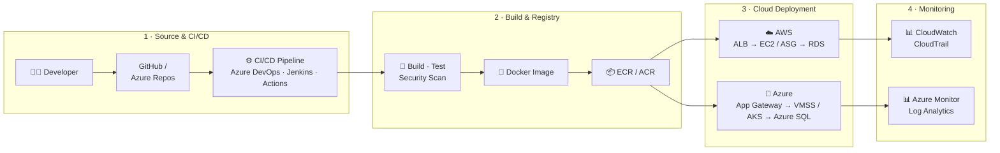
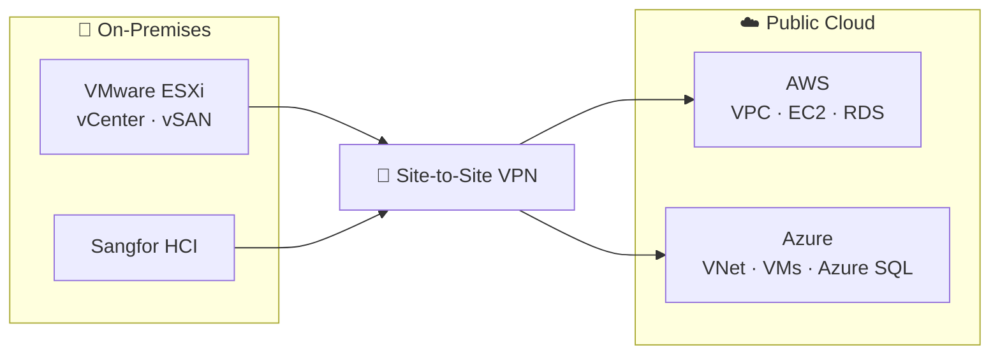
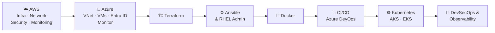

 

**Building secure, scalable, highly available, and automated cloud infrastructure — across AWS, Azure, and on-prem.**

 

 

---

## 👨‍💻 About Me

I'm a **Cloud Infrastructure & DevOps Engineer** who designs, automates, deploys, and maintains reliable infrastructure and application delivery platforms — in **public cloud (AWS & Azure)**, **on-premises virtualization**, and **hybrid** environments.

| | Focus Area |
|---|---|
| ☁️ | **Multi-cloud infrastructure** on AWS and Microsoft Azure |
| 🏗️ | **Infrastructure as Code** with Terraform and Ansible |
| 🔄 | **CI/CD** with Azure DevOps Pipelines, Jenkins, and GitHub Actions |
| 🐳 | **Containers & orchestration** with Docker, Kubernetes, and AKS |
| 🎩 | **Red Hat Enterprise Linux** administration, SELinux, LVM, and automation |
| 🖥️ | **Hybrid & on-prem** — VMware ESXi, vCenter, and Sangfor HCI |
| 🔐 | **Security & DevSecOps** — least privilege, secrets, policy, and hardening |
| 📊 | **Monitoring & observability** — CloudWatch, Azure Monitor, and log analytics |

> 🤝 Open to collaborating on **Cloud, DevOps, and Infrastructure** projects.

---

## 🧰 Tech Stack

  

 

<table>
<tr>
<td width="25%" valign="top">

**☁️ Cloud**
- AWS
- Microsoft Azure
- Hybrid Cloud

</td>
<td width="25%" valign="top">

**🏗️ IaC & Config**
- Terraform
- Ansible
- Version-controlled infra

</td>
<td width="25%" valign="top">

**🔄 CI/CD**
- Azure DevOps
- Jenkins
- GitHub Actions

</td>
<td width="25%" valign="top">

**🐳 Containers**
- Docker · Podman
- Kubernetes
- AKS · ACR

</td>
</tr>
<tr>
<td valign="top">

**🖥️ Virtualization**
- VMware ESXi
- vCenter · vSAN
- Sangfor HCI

</td>
<td valign="top">

**🔐 Security**
- IAM · Entra ID
- KMS · Key Vault
- Defender for Cloud

</td>
<td valign="top">

**📊 Observability**
- CloudWatch
- Azure Monitor
- Log Analytics

</td>
<td valign="top">

**🐧 Systems**
- RHEL · CentOS · Ubuntu
- Bash · Python
- Networking

</td>
</tr>
</table>

---

## ☁️ Cloud & Infrastructure

<b>🟠 Amazon Web Services (AWS)</b>

 

| Category | Services |
|---|---|
| **Compute** | EC2, Auto Scaling Groups, Launch Templates |
| **Networking** | VPC, Public/Private Subnets, Route Tables, Internet Gateway, NAT Gateway, Security Groups, Network ACLs, Application Load Balancer |
| **Storage & Database** | S3, EBS, RDS |
| **Security & Management** | IAM, KMS, CloudTrail, CloudWatch, Route 53 |

<b>🔵 Microsoft Azure</b>

 

| Category | Services |
|---|---|
| **Compute** | Virtual Machines, Virtual Machine Scale Sets (VMSS), Availability Sets & Zones, Azure App Service |
| **Networking** | Virtual Network (VNet), Subnets, NSGs, Route Tables (UDR), NAT Gateway, VNet Peering, Azure Load Balancer, Application Gateway, Azure DNS, Azure Bastion, VPN Gateway |
| **Storage & Database** | Blob Storage, Managed Disks, Azure Files, Azure SQL Database, Azure Database for MySQL / PostgreSQL |
| **Identity & Security** | Microsoft Entra ID (Azure AD), Azure RBAC, Managed Identities, Key Vault, Microsoft Defender for Cloud, Azure Policy |
| **Containers** | Azure Kubernetes Service (AKS), Azure Container Registry (ACR), Azure Container Instances |
| **Monitoring** | Azure Monitor, Log Analytics, Application Insights, Activity Log, Azure Alerts |
| **Governance** | Management Groups, Subscriptions, Resource Groups, Tags, Cost Management |

<b>🔁 AWS ↔ Azure Service Mapping</b>

 

| Capability | AWS | Azure |
|---|---|---|
| Virtual machines | EC2 | Virtual Machines |
| Autoscaling | Auto Scaling Groups | VM Scale Sets |
| Virtual network | VPC | VNet |
| Network firewalling | Security Groups / NACLs | NSGs |
| Load balancing (L7) | Application Load Balancer | Application Gateway |
| Object storage | S3 | Blob Storage |
| Block storage | EBS | Managed Disks |
| Managed database | RDS | Azure SQL / Azure Database |
| Identity & access | IAM | Entra ID + Azure RBAC |
| Secrets & keys | KMS | Key Vault |
| Audit logging | CloudTrail | Activity Log |
| Monitoring | CloudWatch | Azure Monitor / Log Analytics |
| DNS | Route 53 | Azure DNS |
| Kubernetes | EKS | AKS |
| Container registry | ECR | ACR |
| Infrastructure as Code | Terraform | Terraform |

---

## 🔄 DevOps & CI/CD

| Platform | What I Work With |
|---|---|
| **Git, GitHub & Azure Repos** | Branching strategies, pull requests, branch policies, code reviews |
| **Azure DevOps** | Pipelines (YAML & Classic), Repos, Boards, Artifacts, Environments, Service Connections, Variable Groups, Approvals & Gates |
| **Jenkins** | Declarative pipelines, agents, credentials, webhooks |
| **GitHub Actions** | Workflows, reusable actions, secrets, OIDC to cloud |

- Automated build, test, security scan, and deployment
- Deployment strategies (rolling, blue/green) and rollback practices
- Multi-stage pipelines with environment approvals (dev → stage → prod)
- Production-grade deployment workflows

```mermaid
flowchart LR
    subgraph S1["1 · Source & CI/CD"]
        direction LR
        A["👨‍💻 Developer"] --> B["GitHub /<br/>Azure Repos"] --> C["⚙️ CI/CD Pipeline<br/>Azure DevOps · Jenkins · Actions"]
    end

    subgraph S2["2 · Build & Registry"]
        direction LR
        D["🧪 Build · Test<br/>Security Scan"] --> E["🐳 Docker Image"] --> F["📦 ECR / ACR"]
    end

    subgraph S3["3 · Cloud Deployment"]
        direction LR
        G["☁️ AWS<br/>ALB → EC2 / ASG → RDS"]
        H["🔵 Azure<br/>App Gateway → VMSS / AKS → Azure SQL"]
    end

    subgraph S4["4 · Monitoring"]
        direction LR
        I["📊 CloudWatch<br/>CloudTrail"]
        J["📊 Azure Monitor<br/>Log Analytics"]
    end

    C --> D
    F --> G
    F --> H
    G --> I
    H --> J
```

---

## 🏗️ Infrastructure as Code

<table>
<tr>
<td width="50%" valign="top">

### Terraform
- AWS and Azure (AzureRM) provisioning
- Reusable, modular configurations
- Variables, outputs, and remote state
- S3 / Azure Storage backends
- Environment-based infrastructure (dev / stage / prod)
- Version-controlled infrastructure

</td>
<td width="50%" valign="top">

### Ansible
- Server provisioning and configuration management
- Application deployment automation
- Playbooks and roles
- Managing RHEL, CentOS, and Ubuntu fleets

</td>
</tr>
</table>

---

## 🐳 Containers & Kubernetes

<table>
<tr>
<td width="50%" valign="top">

### Docker & Podman
- Dockerfiles, images, and containers
- Docker Compose for multi-container apps
- Container networking and volumes
- Podman, Buildah & Skopeo (rootless containers on RHEL)
- Registries: Docker Hub, ECR, ACR

</td>
<td width="50%" valign="top">

### Kubernetes *(actively building hands-on experience)*
- Pods, Deployments, Services
- ConfigMaps, Secrets, Namespaces
- Ingress and networking
- Persistent Volumes and application scaling
- Managed clusters: **AKS** and EKS

</td>
</tr>
</table>

---

## 🔐 Security & DevSecOps

> Security is part of the infrastructure and deployment lifecycle — not an afterthought.

| Layer | AWS | Azure |
|---|---|---|
| **Identity** | IAM, least-privilege roles | Entra ID, Azure RBAC, Managed Identities |
| **Network** | Security Groups, NACLs | NSGs, Azure Bastion, Private Endpoints |
| **Secrets & Keys** | KMS | Key Vault |
| **Audit** | CloudTrail | Activity Log, Log Analytics |

**Azure posture & governance:** Microsoft Defender for Cloud · Azure Policy

**Also:** SELinux (enforcing mode, contexts, booleans) · firewalld · secure SSH practices · Linux hardening · patch management · CI/CD and container image security scanning

---

## 📊 Monitoring & Observability

| | AWS | Azure |
|---|---|---|
| **Metrics & Alarms** | CloudWatch Metrics & Alarms | Azure Monitor Metrics & Alerts |
| **Logs** | CloudWatch Logs | Log Analytics (KQL queries) |
| **Audit & Activity** | CloudTrail | Activity Log |

**Azure application telemetry:** Application Insights

- Application and system log analysis
- Infrastructure monitoring and incident troubleshooting

---

## 🐧 Linux & System Administration

`RHEL` · `CentOS` · `Ubuntu` · `Linux Networking` · `Users & Permissions` · `SSH` · `systemd` · `Disk & Filesystem Management` · `EBS / Managed Disk Management` · `Package Management` · `Bash Scripting` · `Log Analysis` · `Performance Troubleshooting`

<b>🎩 Red Hat Enterprise Linux (RHEL) Administration</b>

 

| Area | Skills |
|---|---|
| **Packages & Repos** | dnf / yum, RPM, local and remote repositories, AppStream & BaseOS, subscription-manager |
| **Storage** | Partitioning (fdisk / parted), LVM (PV / VG / LV), XFS & ext4, swap, `/etc/fstab`, mounting, Stratis & VDO concepts |
| **Users & Access** | Users, groups, sudoers, file permissions, ACLs, password aging, SSH key authentication |
| **Security** | SELinux (modes, contexts, booleans, troubleshooting), firewalld (zones, services, ports) |
| **Services & Boot** | systemd units & targets, GRUB, boot troubleshooting, root password recovery, tuned profiles |
| **Networking** | NetworkManager (`nmcli`), static IPs, hostname & DNS, bonding concepts |
| **Operations** | Cron & systemd timers, journald / rsyslog log management, process & resource management, NFS / autofs, `ssh` / `scp` / `rsync` |
| **Containers** | Podman, rootless containers, persistent storage, systemd-managed containers |
| **Automation** | Bash scripting, Ansible on RHEL, kickstart concepts |

---

## 🖥️ Virtualization & On-Premises Infrastructure

Building and managing on-prem and hybrid infrastructure alongside cloud environments — bridging traditional virtualization with modern cloud practices.

| Category | Tools & Concepts |
|---|---|
| **Hypervisor** | VMware ESXi — host configuration, resource pools, clusters |
| **Management** | VMware vCenter Server — centralized administration, vMotion, DRS, HA |
| **Storage & HCI** | vSAN, shared storage design, datastore management |
| **Hyperconverged Platform** | Sangfor Cloud (HCI) — compute, storage, and network virtualization |
| **Networking** | vSwitch / dvSwitch, VLANs, virtual network design |
| **Operations** | Snapshots, templates & cloning, backup & disaster recovery, resource monitoring |
| **Migration** | P2V / V2V, workload migration from on-prem to **AWS** and **Azure** (hybrid cloud) |

```mermaid
flowchart LR
    subgraph ONPREM["🏢 On-Premises"]
        direction TB
        V1["VMware ESXi<br/>vCenter · vSAN"]
        V2["Sangfor HCI"]
    end

    VPN["🔗 Site-to-Site VPN"]

    subgraph CLOUD["☁️ Public Cloud"]
        direction TB
        AWS["AWS<br/>VPC · EC2 · RDS"]
        AZ["Azure<br/>VNet · VMs · Azure SQL"]
    end

    V1 --> VPN
    V2 --> VPN
    VPN --> AWS
    VPN --> AZ
```

---

## 🚀 Featured Projects

<table>
<tr>
<td width="50%" valign="top">

### ☁️ AWS Production Infrastructure
Production-style environment:
**VPC → ALB → Auto Scaling → EC2 → RDS**
with security, monitoring, logging, and high-availability practices built in.

</td>
<td width="50%" valign="top">

### 🔵 Azure Infrastructure Deployment
Azure environment:
**VNet → Application Gateway → VMSS → Azure SQL**
with NSGs, Key Vault, RBAC, and Azure Monitor.

</td>
</tr>
<tr>
<td valign="top">

### 🔄 CI/CD Automation
**Azure DevOps / GitHub → Jenkins / Actions → Docker → AWS & Azure**
covering build, test, deployment, approvals, and rollback.

</td>
<td valign="top">

### 🏗️ Infrastructure as Code
AWS and Azure infrastructure provisioned with **Terraform**, using reusable, modular configurations with remote state.

</td>
</tr>
<tr>
<td valign="top">

### 🐳 Containerized Applications
Applications containerized with **Docker**, stored in **ECR / ACR**, and integrated into automated deployment pipelines.

</td>
<td valign="top">

### 🖥️ Hybrid Virtualization Infrastructure
On-prem **VMware ESXi, vCenter, and Sangfor HCI** with HA/DRS configuration and workload migration toward hybrid architectures with **AWS and Azure**.

</td>
</tr>
</table>

---

## 🗺️ Learning Roadmap

```mermaid
flowchart LR
    A["☁️ AWS<br/>Infra · Network<br/>Security · Monitoring"] --> B["🔵 Azure<br/>VNet · VMs · Entra ID<br/>Monitor"]
    B --> C["🏗️ Terraform"]
    C --> D["⚙️ Ansible<br/>& RHEL Admin"]
    D --> E["🐳 Docker"]
    E --> F["🔄 CI/CD<br/>Azure DevOps"]
    F --> G["☸️ Kubernetes<br/>AKS · EKS"]
    G --> H["🔐 DevSecOps &<br/>Observability"]
```

### 🎯 Certifications Targeted

---

## 📈 GitHub Statistics

 

  

**Contribution Heatmap**

---

## 🤝 Let's Connect

I'm always interested in connecting and collaborating on **Cloud, AWS, Azure, DevOps, Infrastructure, Kubernetes, Automation, and DevSecOps** projects.

⭐ Thanks for visiting my profile — feel free to explore my repositories and reach out!

