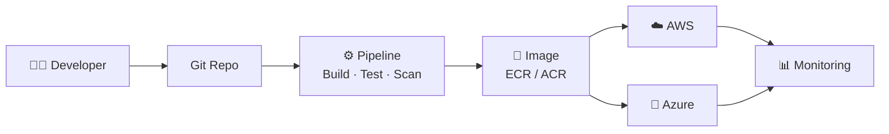
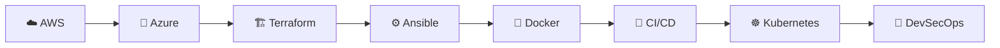

 

**Building secure, scalable, highly available, and automated cloud infrastructure — across AWS, Azure, and on-prem.**

 

 

---

## 👨‍💻 About Me

I'm a **Cloud Infrastructure & DevOps Engineer** focused on designing, automating, and operating reliable infrastructure and delivery platforms across **AWS, Azure, on-premises virtualization, and hybrid environments** — with an emphasis on repeatable deployments, security by design, and operational visibility.

- ☁️ **Cloud** — AWS and Microsoft Azure
- 🏗️ **Automation** — Terraform, Ansible, and CI/CD pipelines
- 🐳 **Containers** — Docker, Kubernetes, and AKS
- 🐧 **Linux** — RHEL, AlmaLinux, CentOS, and Ubuntu
- 🖥️ **Virtualization** — VMware ESXi, vCenter, and Sangfor HCI
- 🔐 **Security & Monitoring** — DevSecOps, CloudWatch, Azure Monitor, and Icinga2

> 🏅 **AWS Certified Solutions Architect – Associate**  ·  🤝 Open to collaborating on Cloud, DevOps, and Infrastructure projects.

---

## 🧰 Tech Stack

  

 

<table>
<tr>
<td width="25%" valign="top">

**☁️ Cloud**
- AWS
- Microsoft Azure
- Hybrid Cloud

</td>
<td width="25%" valign="top">

**🏗️ IaC & CI/CD**
- Terraform · Ansible
- Azure DevOps
- Jenkins · GitHub Actions

</td>
<td width="25%" valign="top">

**🐳 Containers**
- Docker
- Kubernetes
- AKS · ACR

</td>
<td width="25%" valign="top">

**🖥️ Virtualization**
- VMware ESXi · vCenter
- vSAN
- Sangfor HCI

</td>
</tr>
<tr>
<td valign="top">

**🐧 Operating Systems**
- RHEL · AlmaLinux
- CentOS · Ubuntu
- Bash · Python

</td>
<td valign="top">

**🗄️ Databases**
- MariaDB
- AWS RDS
- Azure SQL

</td>
<td valign="top">

**📊 Monitoring**
- CloudWatch
- Azure Monitor
- Icinga2

</td>
<td valign="top">

**🔐 Security**
- IAM · Entra ID
- KMS · Key Vault
- SELinux · firewalld

</td>
</tr>
</table>

---

## ☁️ Cloud Platforms

Designing and operating workloads on both major clouds, with a focus on network isolation, least-privilege access, and high availability.

| | AWS | Azure |
|---|---|---|
| **Compute** | EC2, Auto Scaling Groups, Launch Templates | Virtual Machines, VM Scale Sets, App Service |
| **Networking** | VPC, subnets, route tables, Internet / NAT Gateway, Security Groups, NACLs, ALB, Route 53 | VNet, subnets, UDRs, NAT Gateway, NSGs, Load Balancer, Application Gateway, Bastion, Azure DNS, VPN Gateway |
| **Storage & Data** | S3, EBS, RDS | Blob Storage, Managed Disks, Azure Files, Azure SQL |
| **Identity & Security** | IAM, KMS | Entra ID, Azure RBAC, Managed Identities, Key Vault, Defender for Cloud, Azure Policy |
| **Containers** | ECR, EKS | ACR, AKS |
| **Monitoring & Audit** | CloudWatch, CloudTrail | Azure Monitor, Log Analytics, Application Insights, Activity Log |

**Azure governance:** Management Groups · Subscriptions · Resource Groups · Tags · Cost Management

---

## 🔄 DevOps & CI/CD

Automated pipelines that take code from commit to production with testing, security scanning, approval gates, and rollback.

| Platform | Focus |
|---|---|
| **Azure DevOps** | YAML & Classic Pipelines, Repos, Boards, Artifacts, Environments, Service Connections, Approvals & Gates |
| **Jenkins** | Declarative pipelines, agents, credentials, webhooks |
| **GitHub Actions** | Workflows, reusable actions, secrets, OIDC to cloud |
| **Git** | Branching strategies, pull requests, branch policies, code reviews |

```mermaid
flowchart LR
    A["👨‍💻 Developer"] --> B["Git Repo"]
    B --> C["⚙️ Pipeline<br/>Build · Test · Scan"]
    C --> D["🐳 Image<br/>ECR / ACR"]
    D --> E["☁️ AWS"]
    D --> F["🔵 Azure"]
    E --> G["📊 Monitoring"]
    F --> G
```

---

## 🏗️ Infrastructure as Code & Containers

Infrastructure is versioned and reviewable: Terraform provisions it, Ansible configures it, and containers package the applications that run on it.

| Tool | Focus |
|---|---|
| **Terraform** | AWS and AzureRM provisioning, reusable modules, variables and outputs, remote state, dev / stage / prod environments |
| **Ansible** | Playbooks and roles, configuration management, application deployment across RHEL, AlmaLinux, CentOS, and Ubuntu |
| **Docker** | Dockerfiles, Compose, networking and volumes, registries (Docker Hub, ECR, ACR) |
| **Kubernetes** | Pods, Deployments, Services, ConfigMaps and Secrets, Ingress, Persistent Volumes, scaling — AKS *(actively building hands-on experience)* |

---

## 🔐 Security & Monitoring

Security is part of the delivery lifecycle, and monitoring gives early visibility into problems before users notice them.

| Area | Tools & Practices |
|---|---|
| **Identity & Access** | IAM least-privilege roles, Entra ID, Azure RBAC, Managed Identities |
| **Network Security** | Security Groups, NACLs, NSGs, Azure Bastion, Private Endpoints |
| **Secrets & Governance** | KMS, Key Vault, Defender for Cloud, Azure Policy, CloudTrail |
| **System Hardening** | SELinux, firewalld, SSH hardening, patch management, image scanning in CI/CD |
| **Cloud Monitoring** | CloudWatch (metrics, logs, alarms), Azure Monitor, Log Analytics (KQL), Application Insights |
| **Infrastructure Monitoring** | Icinga2 and Icinga Web 2 — host and service checks, notifications, distributed monitoring (master / satellite / agent), agent rollout with Ansible |

---

## 🐧 Linux & Databases

Administering enterprise Linux servers on the RHEL family (RHEL, AlmaLinux, CentOS) and Ubuntu, plus the databases that run on them.

| Area | Skills |
|---|---|
| **Packages & Repos** | dnf / yum, RPM, local and remote repositories, AppStream & BaseOS |
| **Storage** | Partitioning, LVM, XFS & ext4, swap, `/etc/fstab`, NFS / autofs |
| **Users & Access** | Users, groups, sudoers, permissions, ACLs, SSH key authentication |
| **Security** | SELinux (contexts, booleans, troubleshooting), firewalld (zones, services, ports) |
| **Services & Boot** | systemd units and targets, GRUB, boot troubleshooting, tuned, cron |
| **Networking & Logs** | NetworkManager (`nmcli`), static IPs, DNS, journald / rsyslog |
| **MariaDB** | Installation and configuration, users and privileges, `mysqldump` backup and restore, replication concepts, basic tuning |
| **Managed Databases** | AWS RDS, Azure SQL / Azure Database |

---

## 🖥️ Virtualization & Hybrid Infrastructure

Managing on-prem virtualization alongside cloud environments, and migrating workloads between them.

| Area | Skills |
|---|---|
| **VMware** | ESXi hosts, vCenter, clusters, vMotion, DRS, HA, vSAN, datastores |
| **Sangfor HCI** | Compute, storage, and network virtualization on a unified platform |
| **Operations** | Snapshots, templates and cloning, backup and disaster recovery, VLANs and virtual switches |
| **Migration** | P2V / V2V and on-prem to AWS / Azure workload migration |

---

## 🚀 Featured Projects

<table>
<tr>
<td width="50%" valign="top">

### ☁️ AWS Production Infrastructure
**VPC → ALB → Auto Scaling → EC2 → RDS** with security, monitoring, logging, and high availability built in.

</td>
<td width="50%" valign="top">

### 🔵 Azure Infrastructure Deployment
**VNet → Application Gateway → VMSS → Azure SQL** with NSGs, Key Vault, RBAC, and Azure Monitor.

</td>
</tr>
<tr>
<td valign="top">

### 🔄 CI/CD Automation
**Azure DevOps / GitHub → Jenkins / Actions → Docker → AWS & Azure** with build, test, approvals, and rollback.

</td>
<td valign="top">

### 🖥️ Hybrid Virtualization
**VMware ESXi, vCenter, and Sangfor HCI** with HA/DRS and workload migration toward AWS and Azure.

</td>
</tr>
<tr>
<td valign="top">

### 📊 Monitoring with Icinga2
Linux host and service monitoring with **Icinga2** and **Icinga Web 2**, alerting, and agent rollout through **Ansible**.

</td>
<td valign="top">

### 🗄️ MariaDB on AlmaLinux
**MariaDB** on **AlmaLinux / RHEL** with secured access, scheduled backups, and tested restore procedures.

</td>
</tr>
</table>

---

## 🏅 Certifications & Roadmap

**In progress / planned:**

```mermaid
flowchart LR
    A["☁️ AWS"] --> B["🔵 Azure"] --> C["🏗️ Terraform"] --> D["⚙️ Ansible"] --> E["🐳 Docker"] --> F["🔄 CI/CD"] --> G["☸️ Kubernetes"] --> H["🔐 DevSecOps"]
```

---

## 📈 GitHub Statistics

  

---

## 🤝 Let's Connect

Open to collaborating on **Cloud, DevOps, Infrastructure, Kubernetes, Automation, and DevSecOps** projects.

 

